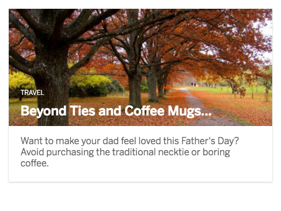

# cells-image-card

[](http://bbva-cells-files.s3.amazonaws.com/cells/bbva-catalog/index.html)
[](https://ui.bbva.com/web_modules/cards/)


[Demo of component in Cells Catalog](https://catalogs.platform.bbva.com/cells)

`<cells-image-card>` is a component that shows a card with an image in row or column direction. It´s possible to display the title over the image or below it. The component have two `<content>` hooks, one with `image-content` to add the media content if it's different of an image, and other with `card-content` to add your content in the card.

Examples:

```html
<cells-image-card heading="Your title" image-url="your-img-url" alt="Your image alt"></cells-image-card>
```

Use `header-inside-image` to display the title over the image:

```html
<cells-image-card
  header-inside-image
  heading="Your title"
  image-url="your-img-url"
  alt="Your image alt">
</cells-image-card>
```

Use `tags-bottom-heading` to display the tags between the header and the content.

```html
<cells-image-card
  heading="Your title"
  image-url="your-img-url"
  alt="Your image alt"
  tags="tag"
  tags-bottom-heading>
</cells-image-card>
```

By default the card is shown in column direction. It´s possible show the card in row direction, add `row` class to component to show it in row direction.

```html
<cells-image-card
  class="row"
  heading="Your title"
  image-url="your-img-url"
  alt="Your image alt">
</cells-image-card>
```

Use the `image-content` slot to display multimedia content, for example, a video.

```html
<cells-image-card heading="Your title">
  <div slot="image-content">
    <iframe src="your-video-url"></iframe>
  </div>
  <div slot="card-content">
    <p>Description</p>
  </div>
</cells-image-card>
```

There is a specific kind of card for products, with the `product-card` attribute. This card has an animation in hover.

```html
<cells-image-card
  product-card
  heading="Your title"
  image-url="your-img-url"
  alt="Your image alt">
</cells-image-card>
```

The card can be a link to navigate to other pages. If this is the case, use the `linkUrl` to specify the next url. Aditionally, use `linkText` to include a link in the bottom of the card.

```html
<cells-image-card
  heading="Your title"
  image-url="your-img-url"
  alt="Your image alt"
  link-text="Link text"
  link-url="next-url">
</cells-image-card>
```

Use the `cardClass` when the card is in a modal component with content centered.

```html
<cells-image-card
  heading="Your title"
  image-url="your-img-url"
  alt="Your image alt"
  card-class="modal-card">
</cells-image-card>
```

## Accessibility

You can use the `heading-level` attribute to define the aria-level of the heading with number type (1-6).

If you provide an image, make sure to provide the right alt text for it using the `alt` attribute in your component.

## Icons

Since this component uses icons, it will need an [iconset](https://bbva.cellsjs.com/guides/best-practices/cells-icons.html) in your project as an [application level dependency](https://bbva.cellsjs.com/guides/advanced-guides/application-level-dependencies.html). In fact, this component uses an iconset in its demo.

## Styling

The following custom properties and mixins are available for styling:

### Custom Properties
| Custom Property                                                    | Selector                                                                                 | CSS Property | Value                                                            |
| ------------------------------------------------------------------ | ---------------------------------------------------------------------------------------- | ------------ | ---------------------------------------------------------------- |
| --cells-fontDefault                                                | :host                                                                                    | font-family  | "sans-serif"                                                     |
| --cells-image-card-wrapper-card-header-heading-tag-color           | .card .card-body [class^=header] .heading-tag                                            | color        |  #CBCBCB |
| --cells-image-card-wrapper-card-header-heading-text-color          | .card .card-body [class^=header] .heading-text                                           | color        | --bbva-600                                                       |
| --cells-image-card-wrapper-card-header-subheading-text-color       | .card .card-body [class^=header] .subheading-text                                        | color        | --bbva-600                                                       |
| --cells-image-card-wrapper-card-content-text-color                 | .card .card-body .card-content                                                           | color        | --bbva-500                                                       |
| --cells-image-card-wrapper-card-product-card-body-margin-left      | .card-product .card-body                                                                 | margin-left  | 1rem                                                             |
| --cells-image-card-wrapper-card-product-card-body-margin-right     | .card-product .card-body                                                                 | margin-right | 1rem                                                             |
| --cells-image-card-wrapper-card-product-card-body-margin-top       | .card-product .card-body                                                                 | margin-top   | 3rem                                                             |
| --cells-image-card-wrapper-card-product-card-header-margin-top     | .card-product .card-body [class^=header]                                                 | margin-top   | 0                                                                |
| --cells-image-card-wrapper-card-product-card-media-margin-top      | .card-product .card-body .heading-text                                                   | margin-top   | -2.5rem                                                          |
| --cells-image-modal-card-wrapper-card-header-heading-tag-color     | .modal-card [class^=header] .heading-tag                                                 | color        |  #CBCBCB |
| --cells-image-modal-card-wrapper-card-header-heading-text-color    | .modal-card [class^=header] .heading-text                                                | color        | --bbva-600                                                       |
| --cells-image-modal-card-wrapper-card-header-subheading-text-color | .modal-card [class^=header] .subheading-text                                             | color        | --bbva-600                                                       |
| --cells-image-modal-card-wrapper-card-header-subheading-text-color | .modal-card .card-content                                                                | color        | --bbva-600                                                       |
| --cells-image-cared-wrapper-card-header-inside-margin-top          | @media (min-width: 768px) > .card .card-body [class^=header].header-inside               | margin-top   | inherit                                                          |
| --cells-image-card-wrapper-card-header-heading-tag-inside-color    | @media (min-width: 768px) > .card .card-body [class^=header].header-inside .heading-tag  | color        | --bbva-white                                                     |
| --cells-image-card-wrapper-card-header-heading-text-inside-color   | @media (min-width: 768px) > .card .card-body [class^=header].header-inside .heading-text | color        | --bbva-white                                                     |
### @apply
| Mixins                                                               | Selector                                                                                 | Value |
| -------------------------------------------------------------------- | ---------------------------------------------------------------------------------------- | ----- |
| --cells-image-card                                                   | :host                                                                                    | {}    |
| --cells-image-card-wrapper-card                                      | .card                                                                                    | {}    |
| --cells-image-card-wrapper-card-media                                | .card .card-media                                                                        | {}    |
| --cells-image-card-wrapper-image                                     | .card .card-media .image                                                                 | {}    |
| --cells-image-card-wrapper-image-img                                 | .card .card-media .image-img                                                             | {}    |
| --cells-image-card-wrapper-card-body                                 | .card .card-body                                                                         | {}    |
| --cells-image-card-wrapper-card-header                               | .card .card-body [class^=header]                                                         | {}    |
| --cells-image-card-wrapper-card-header-heading-tag                   | .card .card-body [class^=header] .heading-tag                                            | {}    |
| --cells-image-card-wrapper-card-header-heading-tag-bottom            | .card .card-body [class^=header] .heading-tag.heading-tag-bottom                         | {}    |
| --cells-image-card-wrapper-card-header-heading-text                  | .card .card-body [class^=header] .heading-text                                           | {}    |
| --cells-image-card-wrapper-card-header-subheading-text               | .card .card-body [class^=header] .subheading-text                                        | {}    |
| --cells-image-card-wrapper-card-content                              | .card .card-body .card-content                                                           | {}    |
| --cells-image-card-wrapper-card-link                                 | .card .card-body .card-link                                                              | {}    |
| --cells-image-card-wrapper-card-product                              | .card-product                                                                            | {}    |
| --cells-image-card-wrapper-card-product-card-media                   | .card-product .card-media                                                                | {}    |
| --cells-image-card-wrapper-card-product-card-image                   | .card-product .card-media .image-product                                                 | {}    |
| --cells-image-card-wrapper-card-product-card-body                    | .card-product .card-body                                                                 | {}    |
| --cells-image-card-wrapper-card-product-card-header                  | .card-product .card-body [class^=header]                                                 | {}    |
| --cells-image-card-wrapper-card-product-card-content                 | .card-product .card-body .card-content                                                   | {}    |
| --cells-image-card-wrapper-card-product-card-link                    | .card-product .card-body .card-link                                                      | {}    |
| --cells-image-card-wrapper-card-product-card-media-heading-text      | .card-product .card-body .heading-text                                                   | {}    |
| --cells-image-card-wrapper-card-product-hover-card-media-image       | .card-product:hover .card-media .image-product                                           | {}    |
| --cells-image-modal-card                                             | .modal-card                                                                              | {}    |
| --cells-image-modal-card-wrapper-card-media                          | .modal-card .card-media                                                                  | {}    |
| --cells-image-modal-card-wrapper-image                               | .modal-card .card-media .image                                                           | {}    |
| --cells-image-modal-card-wrapper-image-img                           | .modal-card .card-media .image-img                                                       | {}    |
| --cells-image-modal-card-wrapper-card-header                         | .modal-card [class^=header]                                                              | {}    |
| --cells-image-modal-card-wrapper-card-header-heading-tag             | .modal-card [class^=header] .heading-tag                                                 | {}    |
| --cells-image-modal-card-wrapper-card-header-heading-tag-bottom      | .modal-card [class^=header] .heading-tag.heading-tag-bottom                              | {}    |
| --cells-image-modal-card-wrapper-card-header-heading-text            | .modal-card [class^=header] .heading-text                                                | {}    |
| --cells-image-modal-card-wrapper-card-header-subheading-text         | .modal-card [class^=header] .subheading-text                                             | {}    |
| --cells-image-modal-card-wrapper-card-content                        | .modal-card .card-content                                                                | {}    |
| --cells-image-modal-card-wrapper-card-link                           | .modal-card .card-link                                                                   | {}    |
| --cells-image-card-wrapper-row                                       | @media (min-width: 768px) > :host(.row)                                                  | {}    |
| --cells-image-card-wrapper-card-row                                  | @media (min-width: 768px) > :host(.row) .card                                            | {}    |
| --cells-image-card-wrapper-image-row                                 | @media (min-width: 768px) > :host(.row) .card .card-media                                | {}    |
| --cells-image-card-wrapper-card-body-row                             | @media (min-width: 768px) > :host(.row) .card .card-body                                 | {}    |
| --cells-image-card-wrapper-image-large                               | @media (min-width: 768px) > .card .card-media .image                                     | {}    |
| --cells-image-card-wrapper-card-body-large                           | @media (min-width: 768px) > .card .card-body                                             | {}    |
| --cells-image-card-wrapper-header-large                              | @media (min-width: 768px) > .card .card-body [class^=header]                             | {}    |
| --cells-image-card-wrapper-card-header-inside-large                  | @media (min-width: 768px) > .card .card-body [class^=header].header-inside               | {}    |
| --cells-image-card-wrapper-card-header-inside-tag-large              | @media (min-width: 768px) > .card .card-body [class^=header].header-inside .heading-tag  | {}    |
| --cells-image-card-wrapper-card-header-inside-text-large             | @media (min-width: 768px) > .card .card-body [class^=header].header-inside .heading-text | {}    |
| --cells-image-card-wrapper-card-content-large                        | @media (min-width: 768px) > .card .card-body .card-content                               | {}    |
| --cells-image-card-wrapper-card-product-large                        | @media (min-width: 768px) > .card-product                                                | {}    |
| --cells-image-card-wrapper-card-product-card-media-large             | @media (min-width: 768px) > .card-product .card-media                                    | {}    |
| --cells-image-card-wrapper-card-product-card-image-large             | @media (min-width: 768px) > .card-product .card-media .image-product                     | {}    |
| --cells-image-card-wrapper-card-product-card-body-large              | @media (min-width: 768px) > .card-product .card-body                                     | {}    |
| --cells-image-card-wrapper-card-product-header-large                 | @media (min-width: 768px) > .card-product .card-body [class^=header]                     | {}    |
| --cells-image-card-wrapper-card-product-card-content-large           | @media (min-width: 768px) > .card-product .card-body .card-content                       | {}    |
| --cells-image-card-wrapper-card-product-card-link-large              | @media (min-width: 768px) > .card-product .card-body .card-link                          | {}    |
| --cells-image-card-wrapper-card-product-hover-card-media-image-large | @media (min-width: 768px) > .card-product:hover .card-media .image-product               | {}    |:
