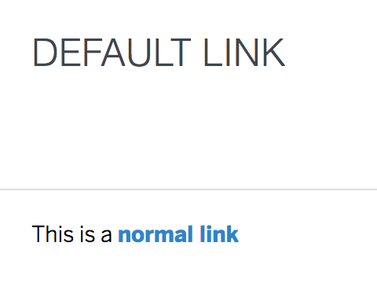

# cells-st-link

[](http://bbva-cells-files.s3.amazonaws.com/cells/bbva-catalog/index.html)

[Demo of component in Cells Catalog](https://catalogs.platform.bbva.com/cells/component/cells-st-link)

`cells-st-link` is a styling wrapper for native link/anchor elements. It should receive an `a` tag as content.

You can use the normal link attributes in the `a` tag, as `href`, `target`...

```html
<cells-st-link>
  <a href="#">My link</a>
</cells-st-link>
```

## Styling

The following custom properties and mixins are available for styling:

### Available classes
- `title` --> Shows cells-st-link as a title


### Custom Properties
| Custom Property                     | Selector                       | CSS Property          | Value               |
| ----------------------------------- | ------------------------------ | --------------------- | ------------------- |
| --cells-fontDefault                 | :host ::slotted(*)             | font-family           | sans-serif          |
| --cells-st-link-font-weight         | :host ::slotted(*)             | font-weight           | 700                 |
| --cells-st-link-color               | :host ::slotted(*)             | color                 | --bbva-medium-blue  |
| --cells-st-link-font-size           | :host ::slotted(*)             | font-size             | `No fallback value` |
| --cells-st-link-color-hover         | :host ::slotted(:hover)        | --cells-st-link-color | --bbva-core-blue    |
| --cells-st-link-color-active        | :host ::slotted(:active)       | --cells-st-link-color | --bbva-core-blue    |
| --cells-st-link-color-focus         | :host ::slotted(:active)       | --cells-st-link-color | --bbva-core-blue    |
| --cells-st-button-bg-color-disabled | :host([disabled]) ::slotted(*) | --cells-st-link-color | --bbva-400          |
### @apply
| Mixins                     | Selector                       | Value |
| -------------------------- | ------------------------------ | ----- |
| --cells-st-link-host       | :host                          | {}    |
| --cells-st-link            | :host ::slotted(*)             | {}    |
| --cells-st-link-hover      | :host ::slotted(:hover)        | {}    |
| --cells-st-link-focus      | :host ::slotted(:focus)        | {}    |
| --cells-st-link-active     | :host ::slotted(:active)       | {}    |
| --cells-st-button-disabled | :host([disabled]) ::slotted(*) | {}    |
